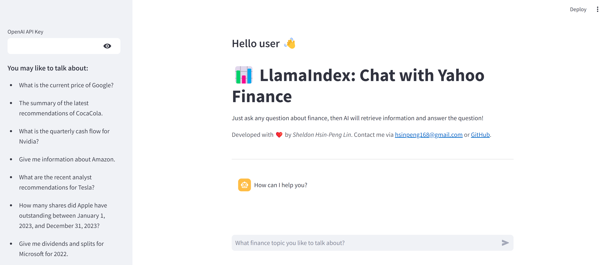

# LlamaIndex: Chat with Yahoo Finance
This application leverages OpenAI's language models, the Yahoo Finance services, and LlamaIndex's agents and tools to provide users with real-time finance information and investment updates to stay on top of the market. 



## Python Libraries
This application is powered by several libraries:
- [Streamlit](https://streamlit.io/): For the User Interface 🖥️
- [Yahoo Finance](https://finance.yahoo.com/): For retrieving finance information 📊
- [LlamaIndex](https://www.llamaindex.ai/): For creating LLMs agents and tools 🔗
- [OpenAI](https://openai.com/): The Large Language Models (LLM) provider 🧠

# Getting started 🏁

## Requirements

The [Python Runtime Environment](https://www.python.org/) should be installed on your computer.
Please choose the latest version of Python 3. The tested Python version is 3.10.12 on Ubuntu 22.04.5 LTS.


## Installation

Clone the repository and install the dependencies:

```bash
git clone [this repository]
cd LlamaIndex-Chat-with-Yahoo-Finance
python3 -m pip install -r requirements.txt
```

## Run the application

```bash
streamlit run chat_yfinance_llamaindex.py
```

# Usage 📖

Thanks to the graphical user interface, the usage of this application is pretty tuitive. 🤓

1. Paste your OpenAI key on the sidebar. The key won't be stored in anywhere. 🚫
2. Enter your query text about any finance question. BTW, some examples are listed on the sidebar as well. ❓
3. The LLM agent will retrieving related information form Yahoo Finance by tool calling or directly anwser your question. 💡


# Features ✨
- Natural language interface for answering any finance questions by LLM agent and tools. 📊
- Providing historical, real-time and worldwide finance information. 📄
- Implementation of LlamaIndex. (Note that most of the related projects are developed by LangChain) 👍


# Improvements 🚀
- Voice interface: Convert user's speech to text and perform a finance question $ answering 🗣️
- Third-party's data sources: Integrating other data sources in addition to Yahoo Finance 🤝
- Providing advanced financial analysis tools 📚


# Background 🧑‍🎓
My name is [Sheldon Hsin-Peng Lin](https://www.linkedin.com/in/sheldon-hsin-peng-lin-51306685/). I'm a software engineer and a research staff. I build various applications in telecommunication industry. 👨‍🔧
Since LLMs are really good at understanding human semantics, and an agent can perform financial analysis by LLM reasoning and tool calling. 📚
This application is developed based on the above conditions, and I hope it can help you as well. 👍

# Acknowledgements 🙏
The application is greatly inspired by [yahoo-finance-llm-agent](https://github.com/ojasskapre/yahoo-finance-llm-agent) which implemented by LangChain. ❤️

